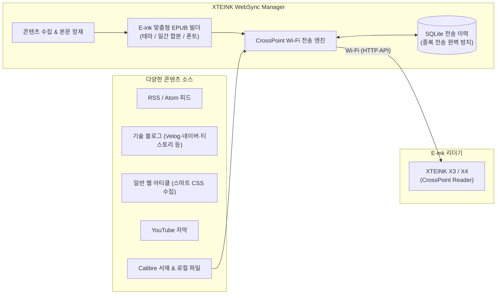

# XTEINK WebSync — CrossPoint Reader를 위한 Web & RSS to EPUB 무선 동기화 매니저

[](https://github.com/twbeatles/xteink-crosspoint-websync/releases/latest)
[](https://www.python.org/)
[]()
[]()
[]()
[](LICENSE)

[🌐 English README](README.md) · [📥 최신 Windows 릴리스 다운로드](https://github.com/twbeatles/xteink-crosspoint-websync/releases/latest) · [📖 상세 사용 설명서](docs/USER_GUIDE.md) · [🛠️ 개발자 가이드](docs/DEVELOPER.md)

---

**XTEINK WebSync**는 **CrossPoint 펌웨어가 탑재된 XTEINK X3 및 X4** 전자책 단말기를 위한 올인원 데스크톱 동기화 도구입니다. 뉴스, 기술 블로그, RSS/Atom 피드, 웹 아티클, YouTube 자막을 전자잉크(E-ink) 디스플레이에 최적화된 고품질 **EPUB** 전자책으로 자동 변환하고, 번거로운 USB 케이블 연결 없이 **Wi-Fi 무선 네트워크를 통해 기기로 즉시 전송**합니다.

SQLite 기반의 스마트 증분 동기화로 이미 읽은 글은 자동으로 중복 방지되며, PC에 보관 중인 **Calibre** 서재의 전자책이나 로컬 소장 도서(EPUB, PDF, MOBI, TXT)도 원클릭으로 리더기에 무선 전송할 수 있습니다.



---

## 📌 지원 기기 및 환경

| 구분 | 지원 세부 사항 |
| :--- | :--- |
| **공식 확인 기기** | **XTEINK X3**, **XTEINK X4** (CrossPoint 펌웨어 구동) |
| **기타 하드웨어** | CrossPoint의 `File Transfer` 또는 `Calibre Wireless` HTTP API를 제공하는 기기 호환 |
| **연결 방식** | PC와 기기가 동일한 Wi-Fi 네트워크에 접속 (`crosspoint.local` 또는 기기 LAN IP) |
| **데스크톱 앱 (추천)** | Windows 전용 무설치 포터블 실행 파일 (`.exe`) |
| **소스 코드 실행** | Python 3.10 이상 (Windows, macOS, Linux 크로스 플랫폼 지원) |

> ⚠️ **연결 참고**: XTEINK X3/X4 단말기에서 **File Transfer** 또는 **Calibre Wireless** 모드를 켠 상태에서 PC와 동일한 공유기(Wi-Fi)에 연결되어 있어야 무선 전송 및 파일 관리가 가능합니다.

---

## 🚀 빠른 시작 (Quick Start)

### 방법 1. Windows 실행 파일 사용 (일반 사용자 추천)

복잡한 설치 과정 없이 바로 실행할 수 있는 단일 포터블 실행 파일입니다.

1. **다운로드**: [GitHub Releases 최신 버전](https://github.com/twbeatles/xteink-crosspoint-websync/releases/latest)에서 실행 파일(`xteink-crosspoint-websync-v1.1.1.exe` 등)을 다운로드합니다.
2. **기기 연결**: 프로그램을 실행한 후, **뉴스 동기화** 탭의 **X3 주소** 입력창에 기기의 IP 주소(예: `192.168.0.25`) 또는 `crosspoint.local`을 입력하고 **[연결 확인]**을 누릅니다.
3. **사이트 등록 및 동기화**: **[사이트 추가]**를 눌러 추천 프리셋(토스, 카카오, 뉴닉 등)을 선택하거나 원하는 RSS 주소를 입력한 뒤, 하단의 **[즉시 전체 뉴스 스크래핑 및 X3 동기화 실행]**을 클릭합니다.

> 💡 **안내**: 실행 파일과 동일한 폴더에 `config.json`(설정), `sync_history.db`(전송 이력), `output/`(생성된 EPUB), `logs/`(로그)가 자동 생성됩니다.

### 방법 2. Python 소스 코드 직접 실행 (개발자 및 고급 사용자)

macOS, Linux 환경이거나 최신 개발 기능을 직접 사용하려는 경우 소스에서 실행할 수 있습니다.

```bash
# 1. 저장소 복제
git clone https://github.com/twbeatles/xteink-crosspoint-websync.git
cd xteink-crosspoint-websync

# 2. 가상환경 생성 및 활성화 (권장)
python -m venv .venv
# Windows:
.venv\Scripts\activate
# macOS/Linux:
source .venv/bin/activate

# 3. 필수 의존성 설치
pip install -r requirements.txt

# 4. (선택 사항) 표지 생성, 유튜브 자막, 번역, 폴더 감시 패키지 설치
pip install -r requirements-optional.txt

# 5. GUI 프로그램 실행
python x3_websync.py
```

### 💻 유용한 CLI 명령어

GUI 창 없이 백그라운드 자동화나 상태 점검을 수행할 때 유용한 명령어들입니다.

```bash
# 설정된 모든 사이트 수집 및 무선 전송 즉시 실행 (스케줄러/헤드리스용)
python x3_websync.py --sync

# 최신 릴리스 업데이트 확인
python x3_websync.py --check-update

# 현재 설치된 버전 정보 출력
python x3_websync.py --version

# 핵심 모듈 무결성 점검 (스모크 테스트)
python x3_websync.py --smoke
```

---

## ✨ 핵심 기능 상세 안내

### 1. 13종 콘텐츠 스크래퍼 & 스마트 CSS 도우미
웹상의 다채로운 텍스트 콘텐츠를 안정적으로 수집합니다.
- **표준 피드 지원**: RSS 2.0 및 Atom 피드 완벽 지원.
- **국내외 주요 플랫폼 전용 스크래퍼**:
  - `Velog` (개발자 기술 블로그)
  - `네이버 블로그` (모바일/PC 본문 정제 수집)
  - `티스토리` (Tistory 블로그)
  - `브런치` (Brunch 작가 글 수집)
  - `뉴닉(NEWNEEK)` (시사/트렌드 아티클)
  - `순살브리핑(Soonsal)` & `어피티 머니레터(Moneyletter)` (금융/경제 뉴스레터)
  - `Substack` (글로벌 뉴스레터)
  - `네이버 공개 카페` (로그인이 필요 없는 공개 게시글)
  - `YouTube 자막` (채널 피드의 최근 영상에서 한국어 공식/자동 생성 자막을 텍스트로 추출)
- **GUI 내장 CSS 선택자 분석 도우미 (Selector Assistant)**:
  - 전용 스크래퍼가 없는 일반 웹사이트도 URL만 입력하면 HTML DOM 트리를 실시간 분석합니다.
  - RSS 피드 존재 여부를 자동으로 감지하여 최적의 설정을 추천하며, 글 목록/제목/링크/본문 선택자를 클릭 몇 번으로 자동 완성하고 수집 미리보기를 제공합니다.

### 2. E-ink 디스플레이 맞춤형 EPUB 빌더
전자책 단말기에서 최상의 가독성을 느낄 수 있도록 세심하게 디자인되었습니다.
- **E-ink 특화 테마 제공**: `default`, `serif_classic`, `sans_modern`, `dark_eink` 등 취향에 맞는 타이포그래피 테마 선택 가능.
- **사용자 지정 스타일링**: 나만의 커스텀 CSS 파일 적용 지원, 본문 폰트, 글자 크기(Font Size), 줄 간격(Line Height) 조절 기능.
- **일간 합본 빌드 지원**: 매일 수집되는 수십 편의 아티클을 사이트별 단권으로 만들거나, 하루 치를 깔끔하게 묶은 **일간 종합 EPUB(Daily Digest)**으로 묶어 생성 가능.
- **깔끔한 본문 정제 및 표지 자동 생성**: 불필요한 광고, 공유 버튼, 스크립트 태그를 완벽히 제거하며, 도서 표지(Cover Image) 자동 생성 지원.

### 3. 스마트 무선 동기화 & 증분 업데이트
- **Wi-Fi 다이렉트 전송**: 케이블을 꽂을 필요 없이 CrossPoint의 HTTP API를 통해 기기로 전자책을 무선 전송합니다.
- **스마트 증분 동기화 (중복 전송 방지)**: SQLite 데이터베이스(`sync_history.db`)를 이용해 이미 기기에 전송한 글의 URL과 해시를 추적합니다. 새롭게 올라온 신규 글만 선별 수집·전송하여 기기의 저장 공간과 배터리를 아낍니다.
- **뉴스 프리뷰 (선택 동기화)**: 전체 자동 동기화 전, 오늘 새로 수집된 글 목록을 미리 열람하고 읽고 싶은 기사만 체크하여 선별 전송할 수 있습니다.
- **다중 기기(Multi-device) 배포**: 여러 대의 X3/X4를 등록하여 한 번의 클릭으로 여러 단말기에 동시에 책을 배포할 수 있습니다.

### 4. Calibre 서재 연동 & 로컬 도서 즉시 전송
- **Calibre 라이브러리 직접 연동**: PC에 설치된 Calibre 데이터베이스(`calibredb`)를 조회하여, 서재에 있는 책을 검색하고 기기로 즉시 무선 전송합니다.
- **로컬 파일 직접 전송**: 뉴스 수집 외에도 소장 중인 `EPUB`, `PDF`, `MOBI`, `TXT` 파일을 선택하여 기기로 다이렉트 업로드할 수 있습니다.
- **Calibre 다운로드 폴더 자동 감시 (Watchdog)**: 지정한 폴더에 새로운 전자책 파일이 저장되면 이를 감지하여 자동으로 XTEINK 리더기로 전송합니다.

### 5. 기기 SD카드 파일 관리자 (CrossPoint File Manager)
기기의 `File Transfer` 모드와 연동하여 리더기 내부를 PC에서 편리하게 관리합니다.
- **SD카드 파일 브라우징**: 리더기 내 폴더와 파일 목록을 조회하고 용량을 확인합니다.
- **파일 조작**: PC에서 기기로 새 파일 업로드, 기기 내 파일 다운로드, 파일 이름 변경, 폴더 간 이동, 삭제 기능.
- **오래된 뉴스 자동 정리(Cleanup)**: 보름이나 한 달이 지난 옛날 뉴스 EPUB 파일을 버튼 하나로 일괄 탐색하고 정리할 수 있습니다.

### 6. 자동화 스케줄러 & 클라우드 데이터 동기화
- **일간 정시 자동 동기화**: Windows 작업 스케줄러(Task Scheduler) 또는 macOS/Linux 스케줄러와 연동하여, 매일 아침 출근/등교 전 지정한 시간에 PC가 자동으로 최신 뉴스를 수집해 단말기로 쏴줍니다.
- **공유 데이터 폴더 지원 (OneDrive / Google Drive / Dropbox)**:
  - 데스크톱과 노트북 등 여러 대의 PC를 오가며 사용하는 경우, 구독 사이트 목록(`sites.json`)과 전송 이력(`synced_posts.json`)을 클라우드 동기화 폴더에 정본으로 보관할 수 있습니다.
  - PC가 바뀌어도 이미 읽은 글이 중복 전송되지 않으며, 구독 설정이 완벽히 유지됩니다.

### 7. 고급 서비스 & 스마트 기능
- **내장 OPDS 카탈로그 서버**: 생성된 EPUB 파일을 OPDS 표준 카탈로그로 서비스하여, 기기 내 OPDS 호환 리더 앱에서 직접 책을 둘러보고 다운로드할 수 있습니다.
- **웹 대시보드 (Web Dashboard)**: 같은 로컬 네트워크 내의 스마트폰이나 태블릿 웹 브라우저에서 동기화를 원격 실행하고 실시간 진행 로그를 확인할 수 있습니다.
- **AI 요약 및 다국어 번역**:
  - OpenAI API 또는 로컬 Ollama 모델을 연동하여 장문의 아티클을 E-ink 첫 페이지에 3줄 요약으로 제공.
  - LibreTranslate 또는 googletrans를 연동하여 해외 영문/일문 아티클을 한국어로 자동 번역 후 전자책 생성.
- **보안 중심의 인앱 자동 업데이트**:
  - GitHub Releases의 최신 버전을 클릭 한 번으로 확인하고 다운로드합니다.
  - Ed25519 디지털 서명과 SHA-256 해시 무결성 검증을 거쳐 안전하게 바이너리를 교체하며, 문제 발생 시 이전 버전으로 자동 롤백됩니다.

---

## 🖥️ 프로그램 화면 구성

프로그램은 직관적인 **5개의 메인 탭**과 하단 **동기화 제어 바**로 구성되어 있습니다.

```
┌────────────────────────────────────────────────────────────────────────┐
│  [뉴스 동기화]   [Calibre 서재]   [동기화 이력]   [기기 파일]   [고급 & 서버]   │
├────────────────────────────────────────────────────────────────────────┤
│                                                                        │
│  • 뉴스 동기화   : 기기 IP 설정, 구독 사이트 목록/프리셋 관리, 스케줄러    │
│  • Calibre 서재  : PC Calibre 도서관 책 검색 및 즉시 무선 전송          │
│  • 동기화 이력   : 보낸 글 내역 조회, 재전송을 위한 이력 삭제, 백업       │
│  • 기기 파일     : XTEINK SD카드 파일 탐색, 업로드/다운로드, 옛 뉴스 정리  │
│  • 고급 & 서버   : 테마/합본 설정, OPDS, 웹 대시보드, AI/번역, 클라우드   │
│                                                                        │
├────────────────────────────────────────────────────────────────────────┤
│  [즉시 전체 뉴스 스크래핑 및 X3 동기화 실행]    [뉴스 프리뷰]    [취소]        │
│  진행 상황: [████████████████░░░░░░] 75% - 네이버 블로그 동기화 완료    │
└────────────────────────────────────────────────────────────────────────┘
```

---

## 📂 파일 구조 및 데이터 보관

프로그램 실행 폴더에는 다음 파일들이 안전하게 관리됩니다:

| 파일 / 폴더 | 설명 | 백업 권장 여부 |
| :--- | :--- | :---: |
| `config.json` | 사용자가 등록한 사이트, 기기 IP, 테마, 스케줄 등 전체 설정 파일 | **필수 백업** |
| `sync_history.db` | 기기별로 전송 완료된 기사 URL 및 메타데이터를 보관하는 SQLite DB | **권장** |
| `output/` | 수집 후 생성된 최종 EPUB 전자책 파일 보관 폴더 | 필요 시 |
| `logs/` | 날짜별 동작 로그 기록 (`sync_YYYY-MM-DD.log`) | 디버깅용 |
| `x3_websync_pipeline.lock` | GUI와 백그라운드 스케줄러 간 동시 실행을 방지하는 프로세스 락 파일 | 자동 관리 |

> 🔒 **보안 안내**: 설정 파일(`config.json`) 내의 AI API 키나 서버 인증 토큰은 화면상에서 마스킹(`****`) 처리됩니다. 클라우드 공유 폴더를 사용할 때도 보안을 위해 API 키와 로컬 경로 등은 클라우드로 전송되지 않고 로컬 PC에만 안전하게 보관됩니다.

---

## ❓ 자주 묻는 질문 및 문제 해결 (FAQ)

### Q1. "기기 연결 확인"을 눌렀는데 연결에 실패합니다.
- 리더기(XTEINK)와 PC가 **동일한 Wi-Fi 공유기**에 연결되어 있는지 확인하세요.
- 리더기 화면에서 **File Transfer** 또는 **Calibre Wireless** 모드가 켜져 있는지 확인하세요.
- `crosspoint.local` 접속이 불안정할 경우, 공유기 관리 페이지나 기기 Wi-Fi 정보 화면에서 기기에 할당된 **숫자 IP 주소**(예: `192.168.0.50`)를 직접 입력해 보세요.

### Q2. 동기화를 실행했는데 "새로 전송할 글이 없습니다"라고 나옵니다.
- 등록된 사이트들이 **활성화(체크)** 상태인지 확인하세요.
- 이미 이전에 전송된 글들은 중복 방지 시스템에 의해 자동으로 건너뜁니다. 다시 전송하고 싶다면 **[동기화 이력]** 탭에서 해당 글을 찾아 **[삭제]**한 후 동기화를 다시 실행하세요.

### Q3. Windows 실행 파일(EXE)에서 YouTube 자막 추출이나 표지 생성이 안 됩니다.
- EXE 배포본은 경량화를 위해 일부 대용량 패키지(`youtube-transcript-api`, `Pillow` 등)가 제외되어 있을 수 있습니다. 해당 기능을 사용하시려면 Python 소스 코드 환경에서 `pip install -r requirements-optional.txt`를 설치한 뒤 실행해 주세요.

### Q4. 매일 아침 자동으로 동기화되게 만들고 싶어요.
- **[뉴스 동기화]** 탭 하단의 **[자동 스케줄 설정]**에서 원하는 시각(예: 매일 07:00)을 선택하고 **[스케줄 등록]**을 누르세요. Windows 작업 스케줄러에 등록되어 지정된 시간에 무선 동기화가 백그라운드로 자동 실행됩니다.

---

## 📚 관련 문서

- [📖 상세 사용자 가이드 (docs/USER_GUIDE.md)](docs/USER_GUIDE.md) — 각 탭별 상세 조작법, CSS 선택자 도우미 활용법, 문제 해결 상세
- [🛠️ 개발자 가이드 (docs/DEVELOPER.md)](docs/DEVELOPER.md) — 아키텍처 다이어그램, 모듈별 책임, 테스트 및 빌드 절차
- [🔍 프로젝트 감사 보고서 (PROJECT_AUDIT.md)](PROJECT_AUDIT.md) — 코드베이스 무결성, 보안, 성능 분석 리포트

---

## 📄 라이선스 (License)

이 프로젝트는 [MIT 라이선스](LICENSE)에 따라 자유롭게 사용, 수정 및 배포할 수 있습니다.
자세한 내용은 [LICENSE](LICENSE) 파일을 참조하세요.
