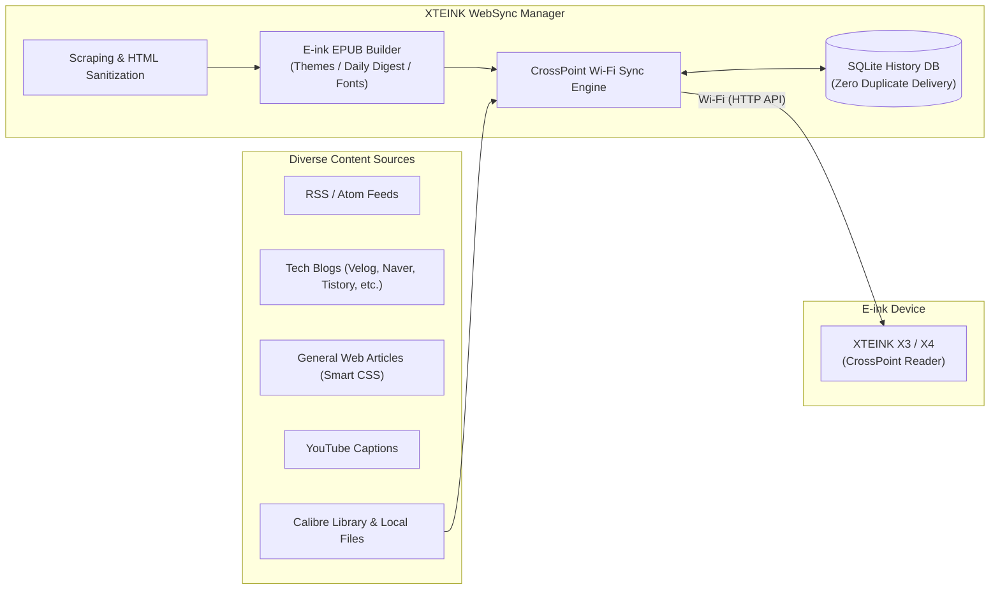

# XTEINK WebSync — Web & RSS to EPUB Wireless Sync for CrossPoint Reader

[](https://github.com/twbeatles/xteink-crosspoint-websync/releases/latest)
[](https://www.python.org/)
[]()
[]()
[]()
[](LICENSE)

[🇰🇷 한국어 안내 (Korean)](README.ko.md) · [📥 Download Latest Release](https://github.com/twbeatles/xteink-crosspoint-websync/releases/latest) · [📖 User Guide](docs/USER_GUIDE.md) · [🛠️ Developer Guide](docs/DEVELOPER.md)

---

**XTEINK WebSync** is an all-in-one desktop companion designed for **XTEINK X3 and X4** e-ink readers running **CrossPoint firmware**. It transforms RSS/Atom feeds, tech blogs, web articles, newsletters, and YouTube captions into beautifully formatted, e-ink-optimized **EPUB** books, delivering them wirelessly over **Wi-Fi** without requiring a physical USB cable.

With built-in SQLite incremental tracking, it automatically eliminates duplicate articles so you only receive fresh content. It also seamlessly connects with your **Calibre** library or local ebook collection (EPUB, PDF, MOBI, TXT), letting you transfer books to your CrossPoint reader with a single click.



---

## 📌 Supported Devices & Environment

| Item | Details & Specifications |
| :--- | :--- |
| **Confirmed Devices** | **XTEINK X3**, **XTEINK X4** running CrossPoint firmware |
| **Other Hardware** | CrossPoint-compatible hardware exposing the `File Transfer` or `Calibre Wireless` HTTP API |
| **Connection** | Same local Wi-Fi network (`crosspoint.local` or reader's LAN IP address) |
| **Desktop App (Recommended)** | Portable standalone Windows executable (`.exe`, no installation required) |
| **Source Execution** | Python 3.10+ on Windows, macOS, or Linux |

> ⚠️ **Connection Note**: Ensure your XTEINK X3/X4 reader is powered on, connected to the same local Wi-Fi router as your PC, and set to **File Transfer** or **Calibre Wireless** mode before initiating sync or file management.

---

## 🚀 Quick Start

### Method 1: Windows Standalone Executable (Recommended for Most Users)

A zero-install, single portable executable for Windows users.

1. **Download**: Grab the latest `xteink-x3-websync-vX.Y.Z.exe` from [GitHub Releases](https://github.com/twbeatles/xteink-crosspoint-websync/releases/latest).
2. **Connect Device**: Launch the executable. In the **News Sync** tab, enter your reader's IP address (e.g., `192.168.0.25`) or `crosspoint.local` into the **X3 Address** field, then click **[Check Connection]**.
3. **Add Sites & Sync**: Click **[Add Site]** to pick from recommended presets (tech blogs, newsletters) or enter your favorite RSS feed URL. Then click **[Run Full Scraping & Sync to X3 Immediately]** at the bottom.

> 💡 **Info**: Configuration (`config.json`), history database (`sync_history.db`), generated books (`output/`), and logs (`logs/`) are automatically stored in the same folder as the executable.

### Method 2: Run from Python Source (Developers & Advanced Users)

Ideal for macOS/Linux users or those wanting to customize and contribute to the code.

```bash
# 1. Clone the repository
git clone https://github.com/twbeatles/xteink-crosspoint-websync.git
cd xteink-crosspoint-websync

# 2. Create and activate a virtual environment
python -m venv .venv
# On Windows:
.venv\Scripts\activate
# On macOS/Linux:
source .venv/bin/activate

# 3. Install core dependencies
pip install -r requirements.txt

# 4. (Optional) Install packages for cover generation, YouTube captions, translation & watchdog
pip install -r requirements-optional.txt

# 5. Start the GUI application
python x3_websync.py
```

### 💻 Useful CLI Commands

Run headless background sync tasks or verify system health from your terminal:

```bash
# Execute full scrape and wireless sync in headless mode (perfect for task schedulers)
python x3_websync.py --sync

# Check for updates from GitHub Releases
python x3_websync.py --check-update

# Display installed version information
python x3_websync.py --version

# Run core-module integrity and smoke check
python x3_websync.py --smoke
```

---

## ✨ Detailed Features

### 1. 13 Content Scrapers & Visual CSS Selector Assistant
Collect text from virtually any web source reliably:
- **Standard Feeds**: Full support for RSS 2.0 and Atom feeds.
- **Dedicated Platform Scrapers**:
  - `Velog` (Tech & developer blogs)
  - `Naver Blog` (Clean article scraping from mobile/desktop layouts)
  - `Tistory` (Korean publishing platform)
  - `Brunch` (Curated essays and articles)
  - `NEWNEEK` (Current events & trend newsletter)
  - `Soonsal` & `Uppity Moneyletter` (Finance and economy briefings)
  - `Substack` (Global newsletters)
  - `Naver Cafe` (Public community board posts)
  - `YouTube Captions` (Extracts Korean official/auto-generated transcripts from recent channel uploads)
- **Visual CSS Selector Assistant**:
  - Automatically inspects any arbitrary website's HTML DOM tree.
  - Detects existing RSS feeds and recommends the best scraper type.
  - Offers interactive point-and-click selection for article item containers, titles, links, and body content with live preview testing.

### 2. E-ink Optimized EPUB Builder
Engineered specifically for superior readability on monochrome electronic ink screens:
- **Tailored E-ink Themes**: Choose between `default`, `serif_classic`, `sans_modern`, and `dark_eink` typography themes.
- **Custom Styling**: Support for user custom CSS, custom fonts, adjustable font size, and line height settings.
- **Daily Compilation (Daily Digest)**: Choose between individual EPUB files per subscription or combine all newly scraped articles from the day into a unified **Daily Digest EPUB**.
- **Content Sanitization & Cover Generator**: Automatically strips distracting ads, social sharing widgets, tracking scripts, and invalid markup. Generates elegant, minimal cover images.

### 3. Smart Wireless Sync & Zero Duplicates
- **Wi-Fi Direct Upload**: Delivers EPUBs straight to the reader via CrossPoint's HTTP file management API.
- **Incremental Deduplication**: Tracks synced article URLs and hashes in an embedded SQLite database (`sync_history.db`). Only delivers genuinely new articles, conserving battery and storage.
- **News Preview (Selective Sync)**: Review freshly fetched articles in a preview modal before syncing. Selectively check only the stories you wish to read today.
- **Multi-Device Support**: Configure multiple XTEINK X3/X4 readers to distribute reading lists across multiple devices simultaneously.

### 4. Calibre Library Integration & Direct File Transfer
- **Calibre Database Integration**: Interacts directly with your PC's Calibre database (`calibredb`) to search, browse, and wirelessly send library books to your reader.
- **Direct Local File Upload**: Send existing `EPUB`, `PDF`, `MOBI`, and `TXT` files straight to the device without USB cables.
- **Calibre Watchdog Directory**: Automatically detects newly saved or moved ebook files in a designated folder and uploads them immediately.

### 5. On-Device SD Card File Manager
Manage files on the XTEINK reader directly from your desktop when in `File Transfer` mode:
- **SD Card Browser**: Explore folders, inspect file sizes, and review stored books on the device.
- **File Operations**: Upload new files, download books back to PC, rename, move between directories, and delete files.
- **Automated Old News Cleanup**: Batch scan and remove outdated daily news EPUBs older than a configurable number of days.

### 6. Automated Scheduler & Cloud Shared Data Folder
- **Scheduled Background Delivery**: Integrates with Windows Task Scheduler (or cron/launchd) to wake up and wirelessly sync reading materials at a set time (e.g., 7:00 AM daily).
- **Cloud Shared Data Folder (OneDrive / Google Drive / Dropbox)**:
  - Synchronize subscription configurations (`sites.json`) and delivery history (`synced_posts.json`) via a cloud storage directory.
  - Switch between desktop and laptop without receiving duplicate articles or losing feed settings.

### 7. Advanced Services & Extensibility
- **Built-in OPDS Catalog Server**: Serves generated EPUBs as a standardized OPDS feed so you can browse and download books directly from OPDS-compatible reader apps.
- **Remote Web Dashboard**: Control sync operations, cancel tasks, and monitor live streaming logs from any smartphone, tablet, or secondary PC on the same Wi-Fi network.
- **AI Summary & Translation**:
  - Summarize long articles into concise bullet points using OpenAI or local Ollama models.
  - Automatically translate foreign articles into your native language using LibreTranslate or googletrans.
- **Secure In-App Updates**: Check releases on GitHub with a single click. Validates releases using Ed25519 digital signatures and SHA-256 integrity hashes with automatic rollback protection.

---

## 🖥️ Application UI Overview

The desktop interface is organized into **5 dedicated tabs** with a persistent bottom control bar:

```
┌────────────────────────────────────────────────────────────────────────┐
│  [News Sync]   [Calibre Library]   [History]   [Device Files]   [Advanced]   │
├────────────────────────────────────────────────────────────────────────┤
│                                                                        │
│  • News Sync       : Device IP, Subscribed sites & presets, Scheduler │
│  • Calibre Library : Search PC Calibre books and upload wirelessly     │
│  • History         : View sent articles, delete entries to re-sync     │
│  • Device Files    : Browse XTEINK SD card, upload/download, cleanup   │
│  • Advanced        : EPUB themes, OPDS, Web Dashboard, AI/Cloud sync   │
│                                                                        │
├────────────────────────────────────────────────────────────────────────┤
│  [Run Full Scraping & Sync Immediately]     [News Preview]     [Cancel]│
│  Progress: [████████████████░░░░░░] 75% - Naver blog sync complete    │
└────────────────────────────────────────────────────────────────────────┘
```

---

## 📂 File Storage & Privacy

All user data is stored locally in the application directory:

| Path | Purpose | Backup Recommended |
| :--- | :--- | :---: |
| `config.json` | Stores device addresses, subscribed feeds, schedules, and preferences | **Essential** |
| `sync_history.db` | SQLite database tracking delivered article URLs to prevent duplicates | **Recommended** |
| `output/` | Directory containing generated EPUB ebooks | Optional |
| `logs/` | Daily execution and error logs (`sync_YYYY-MM-DD.log`) | For diagnostics |
| `x3_websync_pipeline.lock` | Process lock file preventing concurrent GUI and CLI executions | Managed automatically |

> 🔒 **Privacy & Security**: Sensitive credentials such as AI API keys and dashboard auth tokens are masked (`****`) in the UI. When utilizing Cloud Shared Data sync, private keys, device IPs, and local paths are strictly excluded and kept local to your machine.

---

## ❓ Frequently Asked Questions (FAQ)

### Q1. "Check Connection" fails to detect my reader.
- Ensure both your PC and XTEINK reader are connected to the **same Wi-Fi router / subnet**.
- Verify that your reader is currently in **File Transfer** or **Calibre Wireless** mode.
- If mDNS name resolution (`crosspoint.local`) is unsupported by your router, find the reader's numeric IP address (e.g., `192.168.0.50`) in your router or device Wi-Fi menu and enter it directly.

### Q2. Sync finishes, but reports "No new articles found".
- Check that your subscribed sites are checked as **Active**.
- Articles already sent in previous syncs are automatically filtered out. If you wish to re-deliver an article, open the **[History]** tab, delete the entry, and run sync again.

### Q3. YouTube caption scraping or cover generation fails in the Windows EXE.
- The standalone Windows EXE is optimized for lightweight execution and excludes heavy optional dependencies like `youtube-transcript-api` and `Pillow`. To enable these capabilities, run from Python source with `pip install -r requirements-optional.txt`.

### Q4. How do I automate sync every morning?
- In the **News Sync** tab under **Auto Schedule Settings**, select your desired daily delivery time (e.g., `07:00`) and click **[Register Schedule]**. The app will configure a native OS background task (Windows Task Scheduler) to automatically run `--sync` every morning.

---

## 📚 Documentation & Resources

- [📖 Detailed User Guide (docs/USER_GUIDE.md)](docs/USER_GUIDE.md) — Comprehensive walkthrough of each screen, selector assistant, and network configuration.
- [🛠️ Developer Guide (docs/DEVELOPER.md)](docs/DEVELOPER.md) — Architecture diagrams, module responsibilities, PyInstaller build steps, and test suites.
- [🔍 Project Audit Report (PROJECT_AUDIT.md)](PROJECT_AUDIT.md) — Deep-dive audit on code health, performance, and security.

---

## 📄 License
 
This project is licensed under the [MIT License](LICENSE) — see the [LICENSE](LICENSE) file for details.
